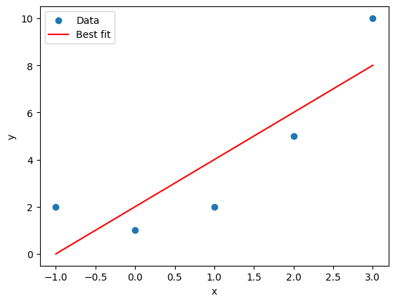
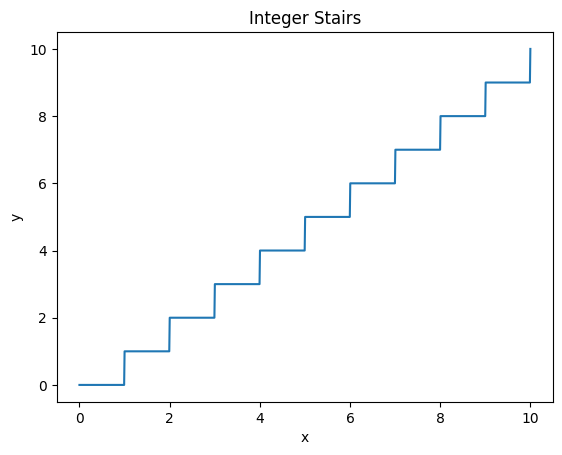

# Graphing Functions

Graphs are fundamental tools for inspecting and communicating with data. 

We begin by importing the `pyplot` plotting library along with `numpy`.

```{python}
import matplotlib.pyplot as plt
import numpy as np
```

## Graphing Functions {#sec-graphingfunctions}

To graph a function, we need a set of $x$ input values with corresponding $y$ output values. We can generate a *linearly spaced* sequence with the `np.linspace` function. Here is how we might graph $\sin(x)$ from $x=0$ to $x=10$:
```{python}
# Data
x = np.linspace(0, 10, 100)
y = np.sin(x)

# Create and display the plot
plt.plot(x, y)
plt.show() 
```
We can turn on `plt.grid()`, or if we just want $x$ and $y$ axes, use: 
```{python}
# Data
x = np.linspace(0, 10, 100)
y = np.sin(x)

# Create and display the plot
plt.axhline(0)
plt.axvline(0)
plt.plot(x, y)
plt.show() 
```

Something interesting happens when we use fewer $x$ values. Here is the same function with only 8 points:

```{python}
# Data
x = np.linspace(0, 10, 8)
y = np.sin(x)

# Create and display the plot
plt.plot(x, y)
plt.show() 
```
The `plt.plot` function plots the points given and then connecting those points by lines. That means the points are accurate representations of the function but the lines between the points are approximations.

## Tangent 

Tangent is a  particularly instructive example. When we graph $\tan(x)$ it might look like this: 
```{python}
x = np.linspace(-2*np.pi, 2*np.pi, 500)
y = np.tan(x)

plt.plot(x, y)
```
Which leads to some observations: 

1. The infinite discontinuities don't seem to actually go to infinity here. 
2. Even though they don't go to infinity, they go far, which stretches the window in the $y$ direction 
3. The dicontinuities are connected when they shouldn't be. 

For observation 1., we aren't evaluating $\tan$ at exactly $\frac{\pi}{2}$, and we aren't getting a $y$ "value" of $\infty$. 

For observation 2. we can adjust our window using `np.xlim` and `np.ylim`. Let's graph $\tan$ again, but this time constrain the window in the y direction:
```{python}
x = np.linspace(-2*np.pi, 2*np.pi, 500)
y = np.tan(x)

plt.plot(x, y)
plt.ylim([-10,10])
```
This is nice, but to address observation 3., those infinite discontinuities are still connected. Well, that might be okay if we understand what we are looking at. Alternatively, we could avoid connecting the lines by using a dense scatter plot, a scatter plot with *lots* of markers:
```{python}
x = np.linspace(-2*np.pi, 2*np.pi, 10000)
y = np.tan(x)

plt.plot(x, y, '.', markersize=1)
plt.ylim([-10,10])
```
<!-- 
Or we can use something a something else a little hack-ish and disconnect $y$ values by removing those too far outside the window: 
```{python}
x = np.linspace(-2*np.pi, 2*np.pi, 500)
y = np.tan(x)

# Remove y values more than 20 away from y=0
y[np.abs(y) > 20] = np.nan 

plt.plot(x, y)
plt.ylim([-10,10])
```
--> 

## Examples 

Below are several example graphs. 

```{python}
x = np.linspace(-3,3,100)
y = x**2 - 4

plt.grid()
plt.axhline(0, color='black')
plt.axvline(0, color='black')
plt.plot(x,y, linewidth=3)
```

```{python}
x = np.linspace(0,20,100)
y = x + np.sin(x)

plt.axhline(0, color='black')
plt.axvline(0, color='black')
plt.plot(x,y, color='orange')
```

```{python}
x = np.linspace(0,10,100)
y = np.exp(-x)

plt.axhline(0, color='black')
plt.axvline(0, color='black')
plt.plot(x,y)
```

```{python}
# x and y values 
x = np.linspace(0,2,100)
y1 = np.exp(-x)
y2 = np.sin(x) 
y3 = np.cos(x) 

# Draw the axes 
plt.axhline(0, color='black')
plt.axvline(0, color='black')

# Plot the functions 
plt.plot(x,y1)
plt.plot(x,y2)
plt.plot(x,y3)
```

<!--
```{python}
r = np.arange(0, 2, 0.01)
theta = 2 * np.pi * r

plt.subplot(111, projection='polar')
plt.plot(theta, r)                        
```
--> 


## Graphing Summary 

A function graphing template might look something like this: 

```{python}
import numpy as np 
import matplotlib.pyplot as plt 

# x,y data 
x = np.linspace(-10,10, 500)
y = x * np.sin(x)

# Turn on x-y axes 
plt.axhline(0, color='black')
plt.axvline(0, color='black')

# Plot 
plt.plot(x, y)

# Window 
plt.xlim([-10, 10])
plt.ylim([-10, 10])

# Labels 
plt.xlabel('x')
plt.ylabel('y') 
plt.title('x sin(x)')

plt.show() 
```

## Exercises{.unnumbered}

1. Plot the following functions over the interval $-10 \leq x \leq 10$.
    a. 

2. The function $f(x)=\frac{1}{x}$ is undefined at $x=0$. When we graph this function from $-1$ to $1$, we don't always get an error. For example, 
   ```python
   x = np.linspace(-1,1,50)
   y = 1/x 
   ```
   evaluates with no warning, while
   ```python
   x = np.linspace(-1,1,51)
   y = 1/x 
   ```
   will give the warning: 
   ```python
   <python-input-10>:1: RuntimeWarning: divide by zero encountered in divide
   ``` 
   Explain why undefined functions might sometimes run into warnings and sometimes not. 

3. Graph the functions $\sin$, $\cos$, and $\tan$ on the same plot. Be sure that your plot has reasonable bounds so the functions can be clearly viewed (don't let the vertical asymptotes of $\tan$ dominate the vertical zoom).

4. The function $$f(x)=\sin\left(\frac{1}{x}\right)$$ has some interesting behavior around $x=0$. Create graphs of $f(x)$ on the interval $[-1,1]$ using 10, 100, 1000, 10000 points. How many points is enough?

5. Recreate the following graphs as closely as you can:

{width=45%} 
{width=45%}
{width=45%}
{width=45%}

6. The solution to $$\cos(x) = x$$ cannot be found algebraically. However, we can search for an approximate solution by inspecting the graph where $y=\cos(x)$ intersects $y=x$. Plot these two functions and use `plt.xlim` and `plt.ylim` to "zoom" on any points of intersection to estimate their $(x,y)$ coordinate.
