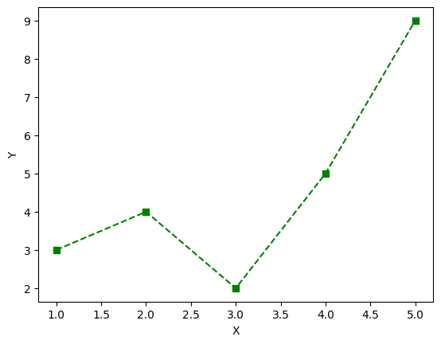
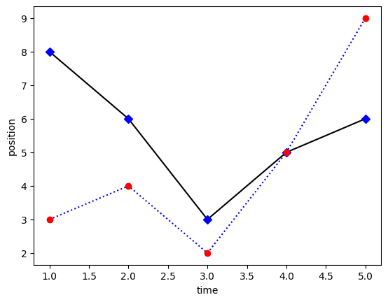
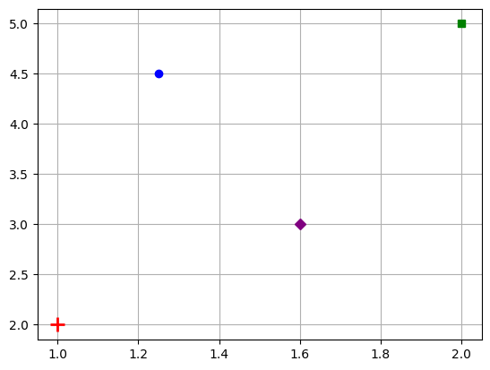
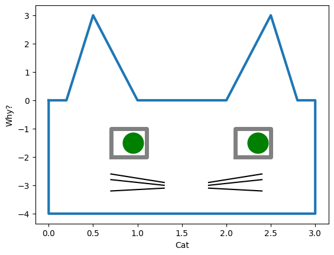
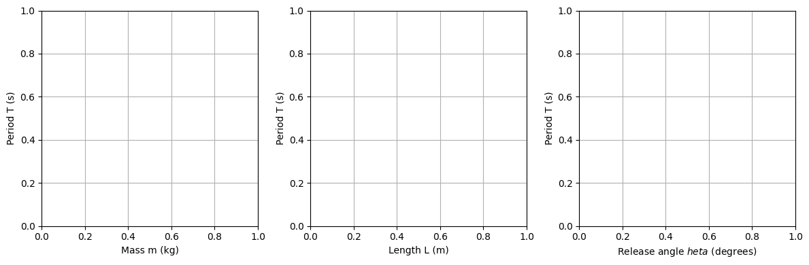

# Graphing with Style

## Style

There is a tremendous amount of customization that can be done with PyPlot graphs. Two important style customizations involve the **marker** and **line**. The *marker* is the point that is plotted, and the *line* is the connection between points. See the PyPlot [marker style reference](https://matplotlib.org/stable/gallery/lines_bars_and_markers/marker_reference.html) and [line style reference](https:/matplotlib.org/stable/gallery/lines_bars_and_markers/linestyles.html).

### Marker

The plot below sets the type of marker as well as some commonly used attributes. 
```{python}
import matplotlib.pyplot as plt

x = [1, 2, 3, 4]
y = [2, 4, 3, 5]

plt.plot( x, y, 
          marker='o',
		  markeredgecolor='red', 
		  markerfacecolor='orange',
		  markersize=10
		 )
plt.show()
```

Some additional marker types include: 

| Marker Type     | Marker Code | Appearance |
|-----------------|-------------|------------|
| Point           | `'.'`       | ·          |
| Plus            | `'+'`       | +          |
| X               | `'x'`       | ×          |
| Circle          | `'o'`       | ○          |
| Square          | `'s'`       | □          |
| Pentagon        | `'p'`       | ⬠          |
| Hexagon         | `'h'`       | ⬡          |
| Diamond         | `'D'`       | ◇          |
| None            | `''`        | (no mark)  |

### Line 

The main customizations for a line include the line style and color. 
```{python}
x = [1, 2, 3, 4]
y = [2, 4, 3, 5]

plt.plot( x, y, 
          linestyle='-.', 
		  color='purple'
		)
plt.show()
```
Some additional line styles include: 

| Line Type | Line Code  | Appearance |
|-----------|------------|------------|
| Solid     | `'-'`      | ─────      |
| Dashed    | `'--'`     | ─ ─ ─ ─    |
| Dashdot   | `'-.'`     | ─ · ─ ·    |
| Dotted    | `':'`      | · · · ·    |
| None      | `''`       | (no line)  |

### Marker and Line Shortcuts 

It is best to write out the explicit attributes you are customizing, but there are some nice shortcuts for convenience. Plot red point markers with dotted line using:
```{python}
x = [1, 2, 3, 4]
y = [2, 4, 3, 5]

plt.plot(x, y, 'r.:')    # Red, point marker, dotted line
plt.show()

plt.plot(x, y, 'ks--')   # Black, square marker, dashed line 
plt.show()
```

Some colors include: 

| Color   | Code  |
| ------- | ----- |
| Blue    | `'b'` |
| Green   | `'g'` |
| Red     | `'r'` |
| Cyan    | `'c'` |
| Magenta | `'m'` |
| Yellow  | `'y'` |
| Black   | `'k'` |

The matplotlib documentation offers several nice [cheat-sheets](https://matplotlib.org/cheatsheets/) that can be printed. 


## Summary 

| Description     | Python                           | 
| :--             | :--                              |
| Label $x$ axis  | `plt.xlabel('X')`                | 
| Label $y$ axis  | `plt.ylabel('Y')`                | 
| Title a graph   | `plt.title('My Plot')`           | 
| Plot and label  | `plt.plot(x,y,label='series1')`  | 
| Turn on legend  | `plt.legend()`                | 
| Turn on grid    | `plt.grid()`                     | 

## Exercises{.unnumbered}

1. Graph the following data set as a scatter plot. On the same plot, draw an approximate best fit line to the data (this is an estimate).

	| x |  0   | 1    | 2    | 3    | 4    | 5    | 6  | 7    | 8    | 9    |
	|---|------|------|------|------|------|------|----|------|------|------|
	| y | 12.5 | 13.1 | 13.2 | 13.2 | 13.8 | 14.1 | 15 | 14.8 | 14.9 | 15.1 |

2. Recreate the following graphs as closely as you can:

{width=45%} 
{width=45%}  
{width=45%}
{width=45%} 

3. Perform a reflex test (or use previous data). Have one person place their hand at the edge of a table with their fingers out. A second person holds a ruler just above the first person's finger tips and lets go at a random time. Without moving their hand, the first person closes their fingers to stop the ruler. For each person,
    - Collect 12 samples of how far the ruler falls before it is caught. 
    - Put the data into a NumPy array. 
	- Create a **histogram** for each person depicting the distribution of their reflex times.
	- Create a **box plot** for each person depicting the distribution of their reflex times.  

4. Consider a pendulum with mass $m$, length $L$, and release angle $\theta$. The **period** $T$ of a pendulum is the amount of time it takes to complete one cycle of motion, swinging from one side to the other and then back again. To model the period of a pendulum, we want to determine the effect that each of the variables $m$, $L$, and $\theta$ have on $T$. We can explore this experimentally by keeping two of the variables constant while changing the third and looking for changes in $T$. 

	- Collect data to populate the following plots:

	
	- Based on your plots, describe the relationship between period $T$ and each of the features: mass, length, and release angle. 


