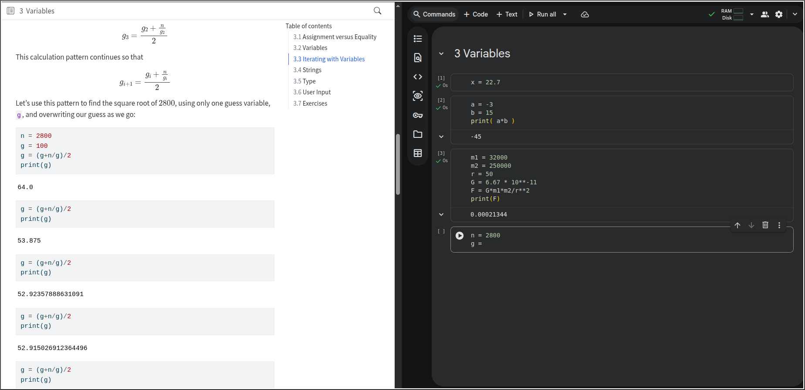

# Introduction

This book is an introduction to doing mathematics with a computer. Due to its popularity and ease of setup, Python is the programming language in which we present material. However, the ideas presented carry over into any language.  

## How to Get the Most Out of This Book 

Practice.

What does good practice look like? It involves sincere curiosity, thinking, and understanding through play. When provided an example, it is good to run the example yourself. It is great to come up with more examples yourself. It is outstanding to try and break things, use ideas in new ways, or demonstrate counterexamples.

It is recommended that you have this book open alongside a Python environment at the same time, and that you type each example yourself as you read.

::: {#fig-windowlayout}



Side-by-side window layout for experimenting with examples.
:::

You really *must* type these things for yourself if you want them to go through your fingers into your brain. 

Learning is hard and shortcuts undermine the process. A common mistake when learning is to focus on completion, getting problems done, or fulfilling requirements to achieve points. There
are times when answering something correctly is consequential, but learning is an experiential process and your education will benefit from immersing yourself in the process. 

## Computing with a Computer {#sec-ieee754}

Computing is what computers are for. It is in the name! However, there are some curious details that emerge when you decide that you want to start doing mathematics with a computer. What even is a number?! How do we store them and how do we operate on them? Irrational numbers, for example, have non-repeating decimal values that go on forever. How can you store something infinite in a finite amount of computer memory? Sometimes you can't [@Whitmore1968]. 

We will take for granted that we can type in an expression and get a result that is probably correct. But there is one point that anyone doing math with a computer should be aware of, and it is that storing numbers on a computer involves encoding that number into a fixed amount of memory (binary bits). The standard encoding for numbers is called a **floating-point** representation and is described in standard IEEE-754-2019 @IEEE754.

The Institute of Electrical and Electronics Engineers (IEEE) is an organization which, among many other things, develops standards for electronics. You might recognize standards like IEEE 802.11 (Wi-Fi) and IEEE 802.3 (Ethernet). Standard IEEE-754-2019 defines the structure of floating-point numbers and how to do arithmetic with them. 

We won't cover the details, but you should know that the consequence of storing numbers on a finite computer, and doing math with these stored numbers, is that our answers are often not exact. However, they are typically *very* close. It sounds funny that using a computer would give us "incorrect" answers, but these answers will be far more precise than we require for most applications.

## Getting Started

The fastest way to get started is to visit [https://colab.research.google.com](https://colab.research.google.com) and click on `+ New notebook`. Google Colab, while it has some challenges, is a useful sandbox platform for playing with Python. Alternatively, you can download Python from [https://www.python.org/downloads/](https://www.python.org/downloads/) and setup your own environment.

Regardless of platform, be sure to **disable AI** and any forms of autocompletion. To do this in Colab, click the gear icon in the top right, then click "AI Assistance", then:

1. Uncheck "Show AI-powered inline completions"
2. Uncheck "Consented to use generative AI features"
3. Check "Hide generative AI features"
4. Click "Close"

Once you have a Python environment to play with, start by writing some basic arithmetic:
```{python} 
3 + 7
```
or print some messages:
```{python}
print("Hello Math!")
```
Throughout this text, you will see comments in the code. A comment is a note to anyone reading the code and it begins with the `#` symbol. 
```{python}
# This is a comment
```
Any text on the same line but after the `#` will ignored when the code is run. Comments can be on their own line or at the end of a line of code. 
```{python}
print(-5*7)  # Result: -35
```
In the code above, the `print` function printed the result of `-5*7` while the comment was ignored. 
