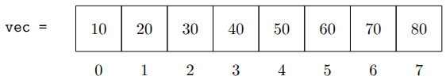
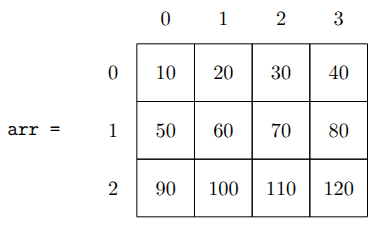

# Slicing Data

**Slicing** is the process of selecting a subset of an array. We start by importing numpy. 
```{python}
import numpy as np 
```

## Slicing in 1-D

Given a 1-D NumPy array named `vec`, the syntax to select a range of indices is:
$$\text{vec} [\text{start} : \text{stop} : \text{step}]$$
where $\text{start}$ is the starting index, $\text{stop}$ is the *excluded* stopping index, and $\text{step}$ is an increment. Consider the array:
```{python} 
vec = np.array([10, 20, 30, 40, 50, 60, 70, 80])
``` 
which has the structure: 

<p align="center">  </p> 

The following examples are slices of `vec`:

| Slice        | Result                 | Description                                |
|--------------|------------------------|--------------------------------------------|
| `vec[1:4]`   | `[20, 30, 40]`         | Elements from index 1 up to 4 (excluded)   |
| `vec[:3] `   | `[10, 20, 30]`         | Elements up to index 3 (excluded)          |
| `vec[3:] `   | `[40, 50, 60, 70, 80]` | Elements from index 3 to the end           |
| `vec[1:5:3]` | `[20, 50]`             | From index 1 to 5 (excluded) skipping by 3 |
| `vec[2::2] ` | `[30, 50, 70]`         | Elements from 2 to the end, skipping by 2  |

Notice that we sometimes leave out numbers around the `:` character. The slice `vec[:3]` says that we start at the beginning and go up to but not including index 3. The slice `vec[3:]` starts at index $3$ and goes up to the end. 

### Specifying Indices {.unnumbered}
We are not constrained to selecting only sequential elements from an array. We can select arbitrary elements by passing a list of which indices we want to select:
```{python}
vec = np.array([10, 20, 30, 40, 50, 60, 70, 80])
vec[ [1,5,6] ]
```


## Negative Indices 

Negative indices count backwards, so `a[-1]` refers to the last element in `a` and `a[-2]` references the second to last element in `a`. 

The *step* in $\text{vec} [\text{start} : \text{stop} : \text{step}]$ can also be negative. Stepping by $-1$ means moving backwards through an array, so that we can effectively reverse an array with:
```{python}
vec = np.array([10, 20, 30, 40, 50, 60, 70, 80])

print( vec[::-1] )
```


## Slicing in 2-D

### Rows and Columns

Slicing a 2-D array requires specifying **rows** and **columns** (in that order). Consider an array `arr`:
```{python}
arr = np.array([[10,  20,  30,  40],
                [50,  60,  70,  80],
                [90, 100, 110, 120]])
```
which has the structure: 
<p align="center"></p>
To select the element $80$ from this array, we would specify row 1 with column 3:
```{python}
print( arr[1,3] )
```
Notice that this returns the value $80$ and *not* a subarray containing the value 80. Indexing a single element within an array references the value at that position.

We can select the entire middle row by specifying row 1 and using `:` to represent "all" columns:
```{python}
print( arr[1,:] )
```
We can select the last column by specifying any row `:` and column 3:
```{python}
print( arr[:,3] )
```


## Updating Values 

### Update an element 

When we use an expression like `arr[1,2]`, we are referencing the element at that row and column. We can `print` as we did above, or we can assign new values. For example:
```{python}
arr = np.array([[10,  20,  30,  40],
                [50,  60,  70,  80],
                [90, 100, 110, 120]])

arr[1,2] = -1
print(arr)
```

### Update Rows or Columns 

We can update subarrays, including entire rows, columns, or the entire array with the same operations we used in @sec-listsarrays. Below, we assign a new value to the third row (index 2) to be equal to $3$ times its current value in each place. 
```{python}
arr = np.array([[10,  20,  30,  40],
                [50,  60,  70,  80],
                [90, 100, 110, 120]])
arr[2] = arr[2] * 3
print(arr)                
```


## Exercises{.unnumbered}

1. Given 

    ```python 
    vec = np.array([10, 20, 30, 40, 50, 60, 70, 80])
    ```

    Determine by hand the result of the following slices, then validate your work with code. 
    a. `vec[2:6]`
    b. `vec[:4]`
    c. `vec[::3]`
    d. `vec[1::2]`
    e. `vec[-3:]`
    f. `vec[:-2]`
    g. `vec[-1]`
    h. `vec[5:2]`
    i. `vec[::-2]`

2. Using the same vector `vec` from the previous question, write the slices that would produce each of these results: 
    a. `[30, 40, 50, 60, 70, 80]`
    b. `[10, 30, 50, 70]`
    c. `[80, 70, 60, 50, 40, 30, 20, 10]`
    d. `[70, 50, 30]`
    e. `[20, 60, 70]`
    f. `[40, 40, 40]`

3. Use slicing to set all of the non-zero elements of `M` to $1$:
    
    ```Python 
    M =  np.array([[ 0, 0, 0, 0, 0, 0, 0, 0],
                   [ 0, 0, 1, 7, 0, 0, 0, 0],
                   [ 0, 0, 4, 3, 0, 0, 0, 0],
                   [ 0, 0, 9, 2, 0, 0, 0, 0],
                   [ 0, 0, 0, 0, 0, 0, 0, 0]])
    ```

4. Given the following array:

    ```python
    A = np.array([[ 10,  20,  30,  40,  50],
                  [ 60,  70,  80,  90, 100],
                  [110, 120, 130, 140, 150],
                  [160, 170, 180, 190, 200]])
    ```

    Write an expression to select each of the following: 
    a. The third row.
    b. The second column.
    c. The value 50.
    d. The last row, using a negative index.
    e. The first two columns, all rows.
    f. The block containing 80, 90, 100, 130, 140, and 150.
    g. Every other row and every other column, starting from the top left.   

5. Start with the array `A` in the previous problem. Write the code to:
    a. Set the value 130 to 0.
    b. Multiply the entire first column by 10.
    c. Replace the last row with all zeros.
    d. Set the four corner values to $-1$, using at most two lines of code.
    e. Reverse the order of the columns.

4. Given a 1-D array named `TwoHundo` containing two hundred random digits, write the one line of code that would set every other element of `TwoHundo` equal to $0$, beginning with the second element. Create such an array and demonstrate your working one-liner. 

